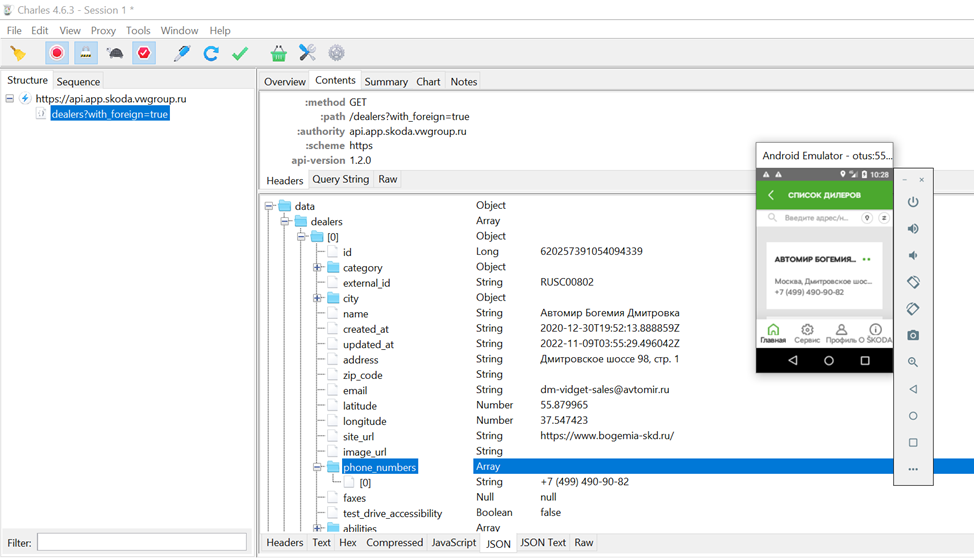

# OtusHomework_5
**Домашнее задание:**
Мобильное тестирование [приложения](https://github.com/nmochalova/Otushome_5/blob/Appium_Selenium/build/app-java-pro-v2.apk) с использованием Appium+Selenide

*Проект содержит следующие тесты:*
- check100PostsTest() - тест, который проверяет, что на странице постов выведены все 100 постов
- checkUserByIdTest() - тест, который кликает по пользователю с заданным ID  и проверяет, что отобразилась информация именно по этому пользователю
- checkPostByIdTest() - тест, который кликает по комментарию с заданным ID и проверяет, что отобразилась информация именно по этому комментарию
- Тесты устанавливают приложение на эмулятор.
- При помощи Charles Proxy был выявлен метод, который выдает ошибку: /ping


Настройка Appium Server v.1.20.2
--

**При запуске в Advanced установить чек-бокс Allow CORS.**

В данной версии Appium Server инспектор открывается по значку лупы и устанавливать его отдельно не нужно.

Appium Inspector


Настройка эмулятора Android
--
В Android Studio поднимаем эмулятор Android. Для ускорения работы лучше работать на самых минимальных разрешениях, с маленькой версией ОС, с отключенными фичами.
Параметры моего эмулятора:
- Android v.5.1 (Lolipop)
- Разрешение 200х300


Посмотреть название эмулятора можно в adb командой:
````
adb devices
````

Настройка Charles Proxy на эмуляторе
--
В настройках Setting -> Proxy


Установить сертификаты Charles в доверенные сертификаты устройства


В Charles Proxy включить трафик SSL:


>Комментарий: Для текущей версии приложения не работает просмотр сниф трафика, то есть посмотреть сломанный метод нельзя. А когда можно будет, то это  будет выглядеть так:
